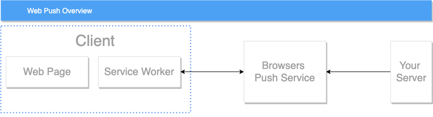
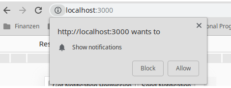
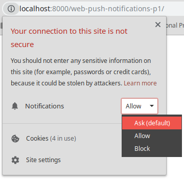
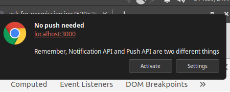

You might not have noticed, but you probably denied at least one notification request permission today.

As developers we are trained to just click “No, please leave me alone” - and move on with our lives.

But don’t take this the wrong way, web push notifications are a great way to get real users – not jaded web developers - to re-visit our website.

As of 2019 web push notifications are only supported in Firefox and Chrome.

For Safari there is a different [implementation](https://developer.apple.com/notifications/safari-push-notifications/), but it doesn't work on iOS.

## TABLE OF CONTENTS

- Overview
- Introducing Notifications API and Push API
- Asking for Permission

---

## OVERVIEW



Before we get into the details of how web push notifications work, we should get an overview of the different APIs and services that are involved.

**Web Page / Web-App:**\
This is where we ask the user for permission to show notifications.

**Service Worker:**\
For an app to receive push messages, it has to have an active service worker. This is where you register the
event-listeners for web push notifications.

**Push Service:**\
Each browser has their own system for handling push notifications called “push service”. When we want to send a push notification to a user, we have to send the message to an endpoint provided by the browsers push service. The push service then sends the message to the user’s device. The endpoint includes an id, so that each endpoint is unique to a user.

---

## INTRODUCING NOTIFICATIONS API AND PUSH API

To make push notifications work, we use two different Web APIs:

**Notifications API:**\
With the Notifications API we can show a message that pops up on the user’s device like any other notification.

**Push API:**\
The Push API – with the help of an active Service Worker - allows us to receive push messages that were sent from a server. These messages can be received whether or not the browser is open. This is possible because service workers can receive messages when the app is in the background, not opened or the browser is closed.

---

## ASKING FOR PERMISSION

Before we can show notifications, we need permission from the user. For that we will use the Notifications API.

```javascript
async function getPermission() {
  result = await Notification.requestPermission();
  console.log(result);
}
```

This will prompt you to allow or block the permission request.



By getting permission to show notifications, you also get permission to show push notifications.

**You can only ask the user once, when the user clicks block, you cannot ask again until the user manually reset the notification settings for your site to default. You should choose a good time to do so.**

I see a lot of websites asking directly after the website is loaded. Honestly, this approach is really bad. Why would I give you the permission to show me notifications, when I don't even know your website yet?



This is how you reset the permission.

## SHOWING NOTIFICATIONS

These notifications don't have to be push notifications, we can also trigger notifications from within our client side Javascript.

To show notifications we need an active service worker.

```javascript
function sendNotification() {
  if ("serviceWorker" in navigator) {
    navigator.serviceWorker.ready.then(function(registration) {
      registration.showNotification("No push needed", {
        body: "Remember, Notification API != Push API",
      });
    });
  }
}
```

This function will show you the notification.



You can get the source code for this blog post [here.](https://github.com/carstenbehrens/web-push-blog-post-part1)

In part two we will finally get into the **push** part of web **push** notifications.
