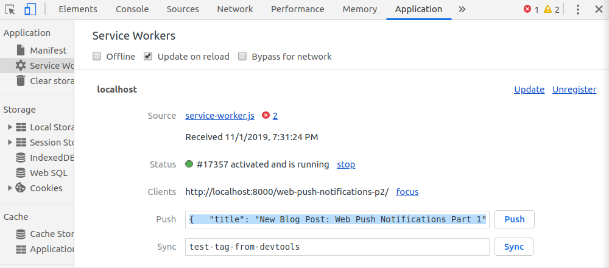

In this part we will add event listeners for the push event in the service worker.
Next we will get the PushSubscription.

## TABLE OF CONTENTS

- Handling Push Events
- Debug Push Notifications
- Getting the Push Subscription
- The Push Subscription

## HANDLING PUSH EVENTS

When we send a push message to a user, the push event gets triggered in the service worker.
To show this push notification we need to trigger the notification in the service worker.

```javascript
self.addEventListener("push", (event) => {
  const data = event.data.json();

  const { title, body, icon } = data;

  event.waitUntil(
    self.registration.showNotification(title, {
      body,
      icon,
    })
  );
});
```

In this code snipped handles the push events.

The **registration.showNotification()** method returns a promise, that is resolved when the notification is shown.
The **event.waitUntil()** method tells the browser that work is ongoing until the promise settles.
This extends the lifetime of the push event until the showNotification Promise resolves.

## DEBUG PUSH NOTIFICATIONS

To test that our push event handler works, we can send a fake push message with the Chrome DevTools.



To do this you can copy and paste the JSON example below.

```json
{
  "title": "New Blog Post: Web Push Notifications Part 1",
  "body": "Get a better understanding of how Web Push Notifications work"
}
```

Now after clicking push, the push notification should be shown.

## GETTING THE PUSH SUBSCRIPTION

Before we can send push messages, we need to get the push subscription.
We do this by calling the **registration.pushManager.subscribe()** method.

```javascript
async function subscribeUser() {
  registration = await navigator.serviceWorker.ready;
  subscription = await registration.pushManager.subscribe({
    userVisibleOnly: true,
    applicationServerKey: urlBase64ToUint8Array(
      "BBAtkVJ3LU8ab8R49xs-WD3PVt7tfLmWcDZHH8zN01ZfUTEc3VTs2PQlpsZxTbAeNPe11vRwaCkf2DpQZ2LTsG8"
    ),
  });

  console.log(JSON.stringify(subscription));
  return subscription;
}
```

To get back the subscription object, we need to pass in **userVisibleOnly**, and the
**applicationServerKey**.

**userVisibleOnly**:\
You must pass in a value of true. This means that you should not send silent pushes - web pushes without showing a notification.

This was added because people were scared that the Push API might be abused for malicious stuff,
without the user knowing.

**applicationServerKey**:\
The applicationServerKey is used by the push service of the browser to identify your web app.
It is the public key that we are sending here, there also is a private key that should be - you guessed it - kept private.
We will need it later to send push messages.

To generate the KeyPair you can head over to [web-push-codelab.glitch.me](https://web-push-codelab.glitch.me/).

## THE PUSH SUBSCRIPTION

The subscription that gets returned from **registration.pushManager.subscribe()** method looks like this:

```json
{
  "endpoint": "https://fcm.googleapis.com/fcm/send/cR3Ymg9at0M:APA91bHXt5kDJ__JY-L3ZmrcC3VOlnF400_s9HvZQgmyjM9tbqxvLRrQuTBeRQoifxMItb_cTQ3Sxl7t553R2Y53dQSBncStFdu99A8qejCamh4XHeJKVCS3bEEM1fCOPLEuZPg7BJqn",
  "expirationTime": null,
  "keys": {
    "p256dh": "BO8IrAO6iEJOpVVkCBMMGt_iBAWUMWdjc4r9GOqiRS1rmPR5KYtZhnkeBb5fHqHp7pudxY6Dy8neJPgNwmKn4q8",
    "auth": "CPWYdCPWXfICigMixAqJ4g"
  }
}
```

The most important property is the **endpoint**. The endpoint is the push services URL. To create a push message we need to send our message to this URL. The endpoint is also a user ID because every endpoint is unique to one user.

Once we have the push subscription from a user, we can finally send web push messages to this user.

In Part 3 we will get into the server side of things.
