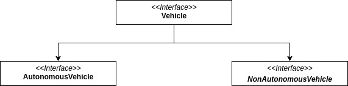

In this series of Blog Posts, I will take a look at SOLID Principles in the context of JavaScript and TypeScript.

**SOLID** is an acronym referring to the SOLID Principles of class design that were
popularized by Robert C. Martin.

Usually, these principles get applied to OOP languages that have classes. JavaScript is different in that it uses prototypal
inheritance instead of classical inheritance. In the code samples, I will be
using ES6 classes because I prefer the new syntax over the ES5 syntax.

## THE INTERFACE SEGREGATION PRINCIPLE

The ISP states that no client should be forced to depend on methods it does not
use.

> Make fine grained interfaces that are client specific.
> Clients should not be forced to implement interfaces they do not use.
> **Robert C. Martin**

"Client" in this case means the implementing class of an interface. No worries
if you don't know what an interface is, I'll explain it below.

This means that the methods of a large interface can be broken up
into groups of methods. If a client does not need a method then the client
should not know about the method / should not have to implement it.

> ISP acknowledges that there are objects that require noncohesive interfaces;
> however, it suggests that clients should not know about them as a single
> class. Instead, clients should know about abstract base classes that have
> have cohesive interfaces.
> **Robert C. Martin**

## What is an interface anyway

The general definition of an interface:

> A situation, way, or place where two things come together and affect each other
> **Cambridge Dictionary**

In object oriented programming Interface can mean a few different things.

In general, the word interface is used to define an abstract class that contains no data but
defines properties and methods of a class.

Interface is also the keyword that is used in Java, C#, Typescript and other
programming languages, so in the context of those languages the word interface
is synonymously used to describe the language-specific type of interface.

Interfaces in C# and Java get often used to enforce that a class meets a particular
contract.

The word interface is also often used to describe the public methods and properties of a class.

**Confused yet?**

As there is no interface language feature in JavaScript I will be using Typescript
to further explain this principle.

In Typescript an interface would look like this:

```typescript
interface Vehicle {
  make: string;
  numberOfWheels: number;
  maxSpeed?: number;
  getReachKm(fuel: number, kmPerLitre: number): number;
}
```

A class having code and data for all the methods corresponding to that interface
and declaring so is said to implement that interface.

In Typescript an implementation of the Vehicle interface could look like this:

```typescript
class Car implements Vehicle {
  make: string;
  numberOfWheels: number;
  maxSpeed: number;

  constructor(make, numberOfWheels, maxSpeed) {
    this.make = make;
    this.numberOfWheels = numberOfWheels;
    this.maxSpeed = maxSpeed;
  }

  getReachKm(fuel: number, kmPerLitre: number) {
    return fuel * kmPerLitre;
  }
}

const carObj = new Car("BMW", 4, 240);
```

## Example

In the above example, we only implemented the Vehicle interface with the Car class.
But what would happen if we also needed to implement a AutonomousCar class?
Obviously, our Vehicle interface would need some extra properties.

Let's say, for the sake of example, that we needed 20 new methods that are exclusively
used by autonomous cars. In this situation, we should segregate the interface
into smaller interfaces that are more client specific.



As a result, we promote decoupling and possibly reduce side effects.
