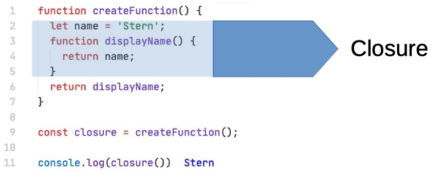

- A closure is the combination of a function bundled together (enclosed) with references to its surrounding state (the lexical environment).

- In other words, a closure gives you access to an outer function's scope from an inner function.

- In JavaScript, closures are created every time a function is created, at function creation time.

**For example:**

In this example the function **createFunction** is the outer function.  
The function displayName is the inner function.

Due to closure the function **displayName** has access to the **name** variable. Even after the function **createFunction** has already run.
