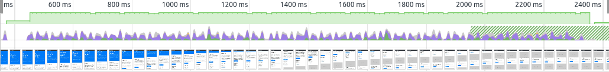
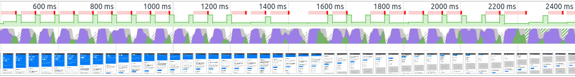

If you ever used Lighthouse on a large news site like you will notice that most large
news sites have more than 2000 DOM nodes.

Here are some examples:

| Website            | Dom Nodes |
| ------------------ | --------- |
| latimes.com        | 2292      |
| washingtonpost.com | 3056      |
| spiegel.de         | 5441      |

The Lighthouse test also suggests that a large DOM size has an impact on performance.
It names specifically style calculations and layout reflows.

**But do I still need to care if my page doesn't change once it is rendered?**

## THE SETUP

For this test, I created a simple bash script that lets me create an HTML file with and duplicate the body X times.

I used [this](https://blackrockdigital.github.io/startbootstrap-business-frontpage/) bootstrap template for this test - out of the box it got a score of 100 on the Lighthouse performance test. It also has CSS styles that are not overly complex or simple.

**This is important because the CSS rules will affect the test results immensely.**

I will use Github Pages to serve the HTML files and then test them with Lighthouse.

## THE TEST

I will run each test three times to iron out some variance.
All tests will be done using the emulated mobile device in Lighthouse.

The results:

| DOM Elements | Style & Layout | Rendering | Parse HTML & CSS |
| ------------ | -------------- | --------- | ---------------- |
| 3550         | 537 ms         | 109 ms    | 143 ms           |
| 7100         | 511 ms         | 182 ms    | 134 ms           |
| 21300        | 1330 ms        | 639 ms    | 369 ms           |
| 28400        | 1858 ms        | 967 ms    | 500 ms           |

The overall performance score drops from 100 to 99 somewhere between 7100 and 21300 DOM elements.

This is happening because the "First CPU Idle" starts to go up as the DOM elements increase - from 1.1s at 3550 DOM elements to 2.4 at 28400 DOM elements.

I also suspected that having this many DOM elements will affect scrolling.

That's why I did some quick tests using the performance tab in Chrome with 6x CPU slowdown.

**3550 Elements:**

3550 DOM elements, still smooth 60 FPS.

**28400 Elements:**

You can see that FPS drop a lot - getting as low as 9 FPS - when you have 28.000 DOM elements.
You can also see that the main thread is very busy rendering.

## CONCLUSION

After doing all the tests I think it's fair to say that if you don't have any dynamic (adding/removing DOM elements/classes) content on your website you should not worry about a DOM that is too big. Anything under 5000 should be totally fine.

Now obviously this is highly dependent on the complexity of your CSS rules. The more complex your CSS rules are, the more you have to watch your DOM size.

On the other hand, if you have a dynamic site, you should about DOM Size and you should also try to keep your CSS selectors as simple as possible.

Of course, the goal should always be to create the best possible experience for our users, but if you have limited time you should worry about other stuff first.

**Keep in mind that this conclusion only applies if your site doesn't change after it is initially rendered!**
