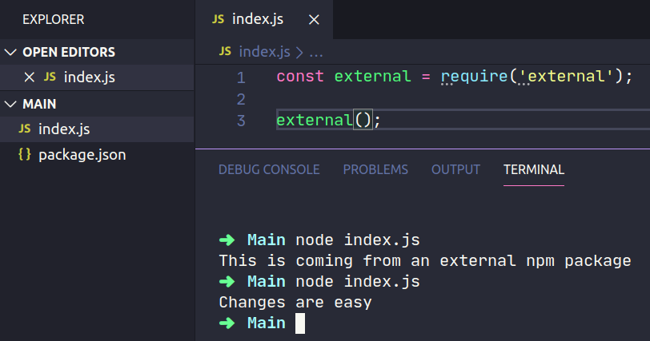

How to effectively work with a project spread on multiple npm packages.

## THE PROBLEM

Let's say you have a project named **main**, this project has a dependency **external** which
is also developed by you.

Now you want to add a new feature to **main** which requires a change in both npm packages.

## THE FIX

1. Go to the external dependency you want to work on, in my case, it's **external**.

2. Create a symbolic link with npm link

```sh
npm link
```

3. Go to the package that uses the external dependency, in my case, it's **main**

```sh
npm link external
```

**external** is the name that is defined in the package.json name property.

4. Enjoy that sweet developer experience


