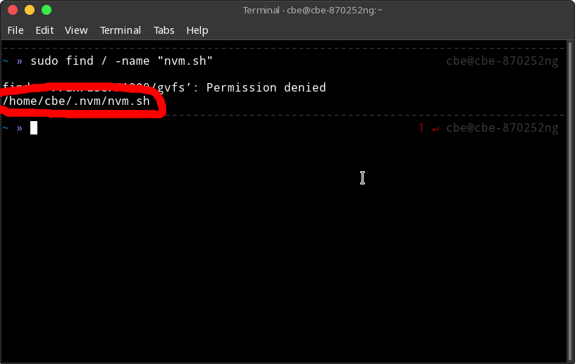

Here is how you can fix "nvm: command not found" on Linux.

## 1. Verify that you have nvm installed

sudo find / -name "nvm.sh"

This command should return the full path of the file.



If it does not return the full path to then the installation of nvm probably was not successful.

### Verify that nvm was installed under the correct path

Also, notice that the .nvm directory is located in my home directory. Your .nvm directory should be
located in your home directory as well.

If it's not, you probably installed .nvm with the wrong user or using sudo.
In this case, you should try to reinstall nvm.

Use this command if you are unsure where your home directory is.

```shell
echo $HOME
```

### Verify that you restarted your terminal session

To use nvm after installation you need to restart your terminal session.
Simply close your current terminal and open a new terminal.

## 2. Source nvm for your Shell

Now you need to source the nvm.sh file, so that nvm can be used in the shell.

### For bash

Add this to your .bashrc

```shell
export NVM_DIR="$HOME/.nvm"
[ -s "$NVM_DIR/nvm.sh" ] && \. "$NVM_DIR/nvm.sh"  # This loads nvm
```

Remember to also use the correct path, it can differ from the path that you see here.
Also notice that you have to enter the nvm directory instead of the full path to the NVM_DIR variable.

After adding the two lines of configuration you should restart your terminal emulator.
Now you should be able to use nvm.

### For zsh

Add this to your .zshrc

```shell
export NVM_DIR="$HOME/.nvm"
[ -s "$NVM_DIR/nvm.sh" ] && \. "$NVM_DIR/nvm.sh"  # This loads nvm
```

Now restart your terminal emulator and that's it, you should be able to use nvm now.

### For fish

This one is a bit more difficult. Since fish is not fully [POSIX](https://en.wikipedia.org/wiki/POSIX)
compliant, it is not compatible with the nvm.sh file nvm provides.

To make it work anyway, we can use [Bass](https://github.com/edc/bass). It allows us to use the nvm.sh
file in the fish shell without any modifications.

We'll use the [Fisher](https://github.com/jorgebucaran/fisher) plugin manager to make the installation process as easy as possible.

#### 1. Install Fisher

```shell
curl -sL https://git.io/fisher | source && fisher install jorgebucaran/fisher
```

#### 2. Install Bass

```shell
fisher install edc/bass
```

#### 3. Source nvm

Now that bass is installed, add this to your config.fish file:

```shell
function nvm
   bass source $HOME/.nvm/nvm.sh --no-use ';' nvm $argv
end
```

Remember to also use the correct path.

That's it! Now you can use nvm in fish.
