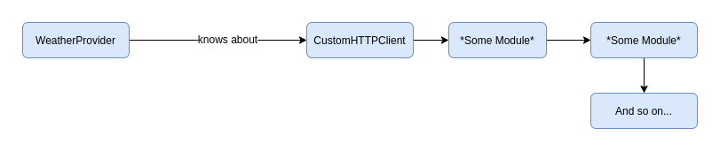

In this series of Blog Posts, I will take a look at SOLID Principles in the context of JavaScript.

**SOLID** is an acronym referring to the SOLID Principles of class design that were
popularized by Robert C. Martin.

Usually, these principles get applied to OOP languages that have classes. JavaScript is different in that it uses prototypal
inheritance instead of classical inheritance. In the code samples, I will be
using ES6 classes because I prefer the new syntax over the ES5 syntax.

## THE DEPENDENCY INVERSION PRINCIPLE

> Modules that encapsulate high-level policy should not depend upon modules
> that implement details. Rather, both kinds of modules should depend upon
> abstractions.
> **Robert C. Martin**
> Or in a more simple way:
> A. High-level modules should not depend on low-level modules. Both should depend on abstractions.
> B. Abstractions should not depend upon details. Details should depend upon abstractions.

This means that an abstraction (interface or abstract class) should not depend
on a detail (concrete classes).

The goal of the DIP is to decouple high-level modules from low-level modules.
This safeguards the higher-level components from possibly breaking changes in
lower-level modules.

The best way to explain the DIP is to look at the flow of control of an exemplary
program. Let's say we have a program that fetches weather data from a weather API.

The simplified code for a class of such program might look like this:

```javascript
import CustomHTTPClient from "CustomHTTPClient";

class WeatherProvider {
  constructor(httpClient = CustomHTTPClient) {
    this.httpClient = httpClient;
  }

  getWeather() {
    return this.httpClient.get("");
  }
}
```

In this example we use a constructor function to provide a CustomHTTPClient to our
WeatherProvider class. The HTTPClient then gets used in the getWeather method
to get some data from some API.

The flow of control looks like this:


This means that **a high-level module depends on a low-level module**. The question
you have to ask yourself is: Do I want my high-level policy to be polluted by
low-level detail?

Now imagine that CustomHTTPClient itself depends on other modules which themselves
depend on even lower-level modules. A change in one of the low-level modules could
break modules that depend on it.


To stop this from happening we need to **invert** the dependency. Basically, we will
add an interface between the two classes.

Afterward, the flow of control should look
like this:


To do this correctly we need to change our code example to Typescript, since
Javascript does not have an interface language feature.

```typescript
interface IhttpClient {
  get(arg0: string): Promise<IhttpClient>;
}

class WeatherProvider {
  httpClient: IhttpClient;

  constructor(httpClient: IhttpClient) {
    this.httpClient = httpClient;
  }

  getWeather() {
    return this.httpClient.get("some api url");
  }
}
```

**We changed the WeatherProvider class in
such a way that it only refers to an abstraction, not to a concrete class.**
