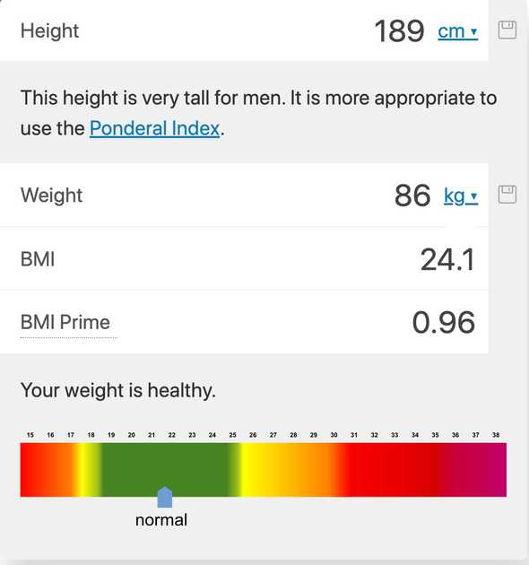

The term business logic is often used by developers when talking about software design and clean code. But understanding what it means can be confusing.

Here is the definition of business logic on Wikipedia:

> In computer software, business logic or domain logic is the part of the program that
> encodes the real-world business rules that determine how data can be created, stored,
> and changed. It is contrasted with the remainder of the software that might be
> concerned with lower-level details of managing a database or displaying the
> user interface, system infrastructure, or generally connecting various parts
> of the program.

After reading this definition I had more questions.

**Do business rules only apply to business matters?**  
**What if my application does not have a database?**  
**Does every application have business logic?**

I'll try to answer all of these and some other questions here.

## CLEARLY UNCLEAR

The truth is, that the term is not clearly defined, there are too many opinions of
what the definition of business logic is, and it's often way easier to understand the term context.

Now it seems like I am not the only one that is confused by this term, as even the

The best way to explain business logic is by using an example.

Imagine that we want to build a web app that calculates the BMI (Body Mass Index).



After users calculate their BMI the information gets saved in a database.

In this example, the business logic could be boiled down to a simple function:

```javascript
function calculateBmi(weight, height) {
  return weight / Math.pow(height, 2);
}

// This is a simplified version.
// You'll also need to consider different units, metric vs. imperial and so on...
```

Obviously business logic often gets way more complex in real-life applications. Try to keep this in mind.

Now let me show you the difference between business logic and the rest of the application.

Let's say we choose [Vue](https://vuejs.org/) as a modern frontend framework to help us build this web app.

Think about all the other code that our imaginary web app will likely have:

- A form users can enter the information
- Some kind of form validation
- A database connection so we can store the data
- Templates to generate our HTML
- CSS to make our web app look pretty

All of this code is **NOT** part of our business logic.

Since that code either deals with the presentation or the database, it is
not part of our business logic.

**What if we changed our frontend framework?**

The calculateBmi function would remain unchanged.

**What if we changed our database?**

The calculateBmi function would remain unchanged.

These questions can help you identify business logic easier. If the code could
remain unchanged, it's a tell-tale sign that it is business logic code.

If you struggle with this example here is another example from the
WikiWikiWeb I have mentioned above:

> It may help to consider a simple but illustrative example like computer chess:
> The game itself, i.e., the board and the pieces, their movements, and how the
> rules of the game are handled independent of any display or user interaction
> is business logic.

## FAQ

**Do business rules only apply to business matters?**

No, that's why the term business logic is also often called domain logic.

**What if my application does not have a database?**

Your application can still have business logic. Since the business logic can be
independent of your database anyway, it does not matter.

**Does every application have business logic?**

Not all applications have business logic. On my [Github](https://github.com/carstenbehrens/cat-facts)
I have a simple exemplary Vue application. It uses the Catfacts API and the
Unsplash API to get a random cat breed and load a picture of that breed.

So all it does is fetching data and displaying it. It does not have business logic.

Photo by <a href="https://unsplash.com/@huntersrace?utm_source=unsplash&utm_medium=referral&utm_content=creditCopyText">Hunters Race</a> on <a href="https://unsplash.com/s/photos/business?utm_source=unsplash&utm_medium=referral&utm_content=creditCopyText">Unsplash</a>
