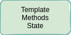
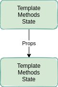
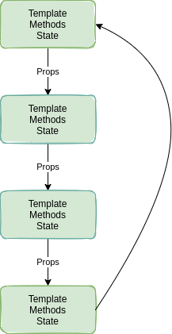
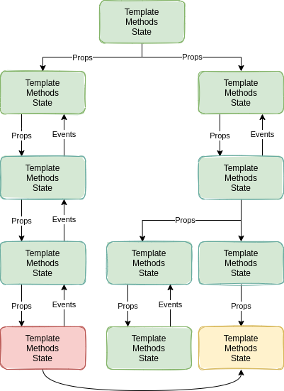
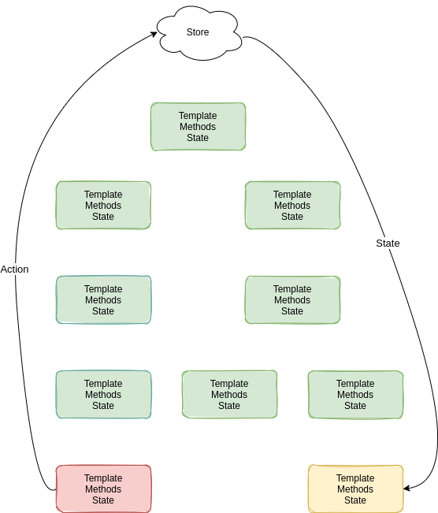

As developers, we sometimes fall into the trap of using technologies just because they are popular
and or commonly used together. That's why it can be beneficial to take a step back and truly understand
the **why** of each technology we use.

In this blog post, I will try to do this in regards to [Vuex](https://vuex.vuejs.org/) while answering
the following question:

- What problem does Vuex solve?
- How does it solve the problem?

## The Beginning

Let's start with just plain old Vue. You only have one component which includes the state, the 
template to render your HTML, and methods that modify that state.



Your component has perfect encapsulation and life is good.

Now you add a second component and you pass it some of the state of the first component via props.



Simple enough.

Now imagine the following scenario: The component at the bottom of this graph needs some state from
the first component.



In this graph you can see that we pass the needed state through many layers of components, 
this approach is referred to as **prop drilling**. It might not seem like a problem by looking
at this simple graph, but imagine what this graph would look like in a large application. 
Things will start to get messy quick.

But what exactly is the cause of increased complexity when using this approach?

- Even if the components in-between don't need the state from the first component, they still need to pass them to the next component. (Increased Coupling)

- The number of changes needed to rename a prop is high. (Code Duplication)

- It becomes less simple to locate the place in your code where the state is modified. This increases cognitive load. (Increased Complexity)

## Your Application Grows

As your application grows, it will eventually come to a point where more and more state is needed by
multiple components scattered across your component hierarchy.

You also often find the need to control part of the state of the parent component by one of its children,
which means you'll now have to trigger events from the child component and listen for them in the parent.

This of course increases coupling even more.

In the graph below you will see a small application that has gotten to the point where global state can simplify the code.



Just imagine what a nightmare it would be if the component red component (bottom left) needs to access state from the yellow component (bottom right).

To solve this issue we have three different options:

1. Move the state up to the top of our component hierarchy, so that we can then pass it down again
   to the components that need it.

2. Send the state up the component hierarchy via events and then pass it down via props.

3. Use global state.

By now you should know that the first two options can become very complex, especially in larger applications. So let's
take a look at the third option.

## Global State

This is where global state comes in, it allows us to access and modify the state from anywhere within our application.

In Vue this could be as simple as doing this:

```javascript
methods: {
    toggleTheme: () => {
      this.$root.darkMode = true;
    }
}
```

Now you could use it in other components simply by referencing `this.$root.darkMode`.

As you can probably tell from the example code we are setting the theme for the application.
In this case, this should truly be available throughout the program, it would not make sense for this to be bound to a component.

The question then arises: If this is approach is so simple why do we need Vuex to manage our global state instead?

The problem with global state is that it has some inherent problems:

- The global state can be modified from anywhere, this means it becomes harder to predict what the value is at runtime and where it was changed from. (Increased Complexity)

- If two components depend on the same global variable, this means that the components are now coupled. This
  is not only a problem of global state as we had the same problem before. But it is a **new** problem if you didn't have any coupling between the components before.

- Makes testing harder. Since now you'll have to mock the global state. (Increased Complexity)

## Flux

This is where Flux comes in. Flux is a pattern for managing data flow in your application. 
I'll try to give you a quick introduction to Flux below.

**So what is Flux?**

Going back to our example from the graph above, where the bottom left component (red) needs state from the bottom right component (yellow).

Here is how this would work in Vuex (which is the official Flux implementation for Vue):



- Components dispatch actions (e.g. user clicks a button)
- The store updates based on what the action it receives (e.g. "increment" will increase the count property in the store)
- Components update when the store updates

Instead of coupling the data with the component, Flux (and therefore Vuex) keeps the data completely separate.

Different implementations of Flux often use different terms and add or omit a few parts of the original pattern, so it can get
confusing sometimes. But at the root, all of the implementations follow the same principle. If you want more information about Flux,
you can get a great overview [here](https://github.com/facebook/flux/tree/main/examples/flux-concepts).

## Vuex

Ok, so Vuex is the official Flux implementation for Vue, and just like the example above shows,
it solves the same "prop drilling" problems like our global state example from the "Global State" section above.

One of the main differences between the global state example and Vuex is that Vuex actually encourages its users to keep [most](https://vuex.vuejs.org/guide/state.html#components-can-still-have-local-state)
of the application state inside the store. That way Vuex becomes the single source of truth.

At the same time, it tries to mitigate the problems that global state inherently has by providing a better
developer experience.

So what are the advantages of Vuex compared to using regular global state?

- Standardized patterns for modifying state
- Better integration with Vue
- Great [Debugging Tools](https://chrome.google.com/webstore/detail/vuejs-devtools/nhdogjmejiglipccpnnnanhbledajbpd?hl=en) and integration in testing utils to allow for [easier testing](https://vue-test-utils.vuejs.org/guides/using-with-vuex.html)
- Better support since it's used a lot by the Vue community

Overall Vuex offers great value for medium to large applications. When you have a small application you
might consider not using it.
